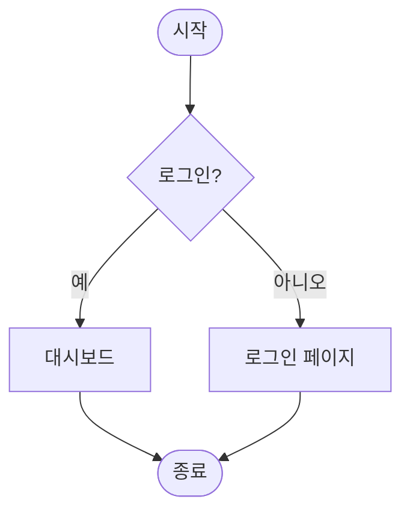

# README.md 파일 작성
## ai를 활용한 계산기 만들기 
**중요해**<br>




markdown
# Simple Calculator (Trendy Calculator)

**Java Swing**를 이용한 간단하고 세련된 GUI 계산기입니다.  
더하기, 빼기, 곱하기, 나누기 기능을 지원하며, 사용자 친화적인 디자인(버튼 스타일링, 여백, 폰트, 색상)을 적용했습니다.

---

## 📂 프로젝트 구조

test.SimpleCalculator/
├── test.SimpleCalculator.java     # 메인 소스 코드 (단일 파일 애플리케이션)
├── README.md                 # 이 문서

> **단일 파일 프로젝트**이기 때문에 별도의 패키지나 빌드 도구(Maven/Gradle)는 필요 없습니다.  
> Java 8 이상만 설치되어 있으면 바로 컴파일/실행 가능합니다.

---

## 🚀 실행 방법

1. **파일 저장**  
   위 `test.SimpleCalculator.java` 코드를 그대로 복사해서 `test.SimpleCalculator.java` 파일로 저장합니다.

2. **컴파일**
   ```bash
   javac test.SimpleCalculator.java

전체 소스 코드java

import javax.swing.*;
import java.awt.*;
import java.awt.event.ActionEvent;
import java.awt.event.ActionListener;

public class test.SimpleCalculator extends JFrame implements ActionListener {

    private JTextField num1Field;
    private JTextField num2Field;
    private JButton addButton;
    private JButton subtractButton;
    private JButton multiplyButton;
    private JButton divideButton;
    private JLabel resultLabel;

    // Define a common button size
    private static final Dimension BUTTON_SIZE = new Dimension(60, 40);
    // Define a common font for buttons
    private static final Font BUTTON_FONT = new Font("Arial", Font.BOLD, 16);
    // Define a common font for labels
    private static final Font LABEL_FONT = new Font("Arial", Font.PLAIN, 14);
    // Define a common font for the result label
    private static final Font RESULT_FONT = new Font("Arial", Font.BOLD, 18);
    public test.SimpleCalculator() {
        // Frame setup
        setTitle("Trendy Calculator");
        setSize(450, 250); // Slightly larger frame for better spacing
        setDefaultCloseOperation(JFrame.EXIT_ON_CLOSE);
        setLayout(new BorderLayout(15, 15)); // Increased gaps for a more spacious feel
        getContentPane().setBackground(new Color(240, 240, 240)); // Light gray background

        // Input Panel
        JPanel inputPanel = new JPanel(new FlowLayout(FlowLayout.CENTER, 15, 15)); // Centered flow layout with gaps
        inputPanel.setBackground(new Color(240, 240, 240)); // Match frame background

        num1Field = new JTextField(10);
        num2Field = new JTextField(10);

        // Style input fields
        num1Field.setFont(LABEL_FONT);
        num2Field.setFont(LABEL_FONT);
        num1Field.setBorder(BorderFactory.createCompoundBorder(
            BorderFactory.createLineBorder(new Color(180, 180, 180), 1), // Outer border
            BorderFactory.createEmptyBorder(5, 5, 5, 5) // Inner padding
        ));
        num2Field.setBorder(BorderFactory.createCompoundBorder(
            BorderFactory.createLineBorder(new Color(180, 180, 180), 1), // Outer border
            BorderFactory.createEmptyBorder(5, 5, 5, 5) // Inner padding
        ));

        inputPanel.add(new JLabel("Number 1:"));
        inputPanel.add(num1Field);
        inputPanel.add(new JLabel("Number 2:"));
        inputPanel.add(num2Field);

        // Operation Buttons Panel
        JPanel buttonPanel = new JPanel(new GridLayout(1, 4, 10, 10)); // Increased gaps between buttons
        buttonPanel.setBackground(new Color(240, 240, 240)); // Match frame background

        addButton = createStyledButton("+");
        subtractButton = createStyledButton("-");
        multiplyButton = createStyledButton("*");
        divideButton = createStyledButton("/");

        buttonPanel.add(addButton);
        buttonPanel.add(subtractButton);
        buttonPanel.add(multiplyButton);
        buttonPanel.add(divideButton);

        // Result Label
        resultLabel = new JLabel("Result: ");
        resultLabel.setFont(RESULT_FONT);
        resultLabel.setHorizontalAlignment(JLabel.CENTER); // Center the result text
        resultLabel.setForeground(new Color(50, 50, 50)); // Darker color for result

        // Add panels to frame
        add(inputPanel, BorderLayout.NORTH);
        add(buttonPanel, BorderLayout.CENTER);
        add(resultLabel, BorderLayout.SOUTH);

        setLocationRelativeTo(null); // Center the window
    }

    // Helper method to create styled buttons
    private JButton createStyledButton(String text) {
        JButton button = new JButton(text);
        button.setFont(BUTTON_FONT);
        button.setPreferredSize(BUTTON_SIZE);
        button.setBackground(new Color(100, 149, 237)); // Cornflower blue for buttons
        button.setForeground(Color.WHITE); // White text
        button.setBorder(BorderFactory.createRaisedBevelBorder()); // Subtle raised effect
        button.setFocusPainted(false); // Remove focus border
        button.addActionListener(this);
        return button;
    }

    @Override
    public void actionPerformed(ActionEvent e) {
        try {
            // Get input values, trim whitespace
            String num1Text = num1Field.getText().trim();
            String num2Text = num2Field.getText().trim();

            if (num1Text.isEmpty() || num2Text.isEmpty()) {
                resultLabel.setText("Error: Enter both numbers");
                return;
            }

            double num1 = Double.parseDouble(num1Text);
            double num2 = Double.parseDouble(num2Text);
            double result = 0;

            if (e.getSource() == addButton) {
                result = num1 + num2;
                resultLabel.setText("Result: " + result);
            } else if (e.getSource() == subtractButton) {
                result = num1 - num2;
                resultLabel.setText("Result: " + result);
            } else if (e.getSource() == multiplyButton) {
                result = num1 * num2;
                resultLabel.setText("Result: " + result);
            } else if (e.getSource() == divideButton) {
                if (num2 == 0) {
                    resultLabel.setText("Error: Division by zero");
                    return;
                }
                result = num1 / num2;
                resultLabel.setText("Result: " + result);
            }
        } catch (NumberFormatException ex) {
            resultLabel.setText("Error: Invalid input");
        } catch (Exception ex) {
            // Catch any other unexpected exceptions
            resultLabel.setText("Error: An unexpected error occurred");
            ex.printStackTrace(); // Log the exception for debugging
        }
    }

    public static void main(String[] args) {
        // Run the GUI creation on the Event Dispatch Thread (EDT)
        SwingUtilities.invokeLater(() -> {
            test.SimpleCalculator calculator = new test.SimpleCalculator();
            calculator.setVisible(true);
        });
    }
}

주요 개념 상세 설명
1. Java Swing이란?Java의 공식 GUI(Graphic User Interface) 라이브러리입니다.
javax.swing.* 패키지를 통해 제공되며, 플랫폼 독립적 (Windows, macOS, Linux 모두 동일하게 동작).
AWT보다 더 현대적이고 풍부한 컴포넌트(버튼, 라벨, 텍스트필드 등)를 제공합니다.

2. 주요 컴포넌트와 레이아웃JFrame: 메인 창(최상위 컨테이너)
   JPanel: 컴포넌트들을 그룹화하는 패널
   BorderLayout (프레임 전체): NORTH(입력), CENTER(버튼), SOUTH(결과)
   FlowLayout (입력 패널): 중앙 정렬 + 간격 조절
   GridLayout (버튼 패널): 1행 4열로 버튼을 균등하게 배치

3. 이벤트 처리 (ActionListener)버튼 클릭 이벤트를 처리하기 위해 ActionListener 인터페이스를 구현합니다.
   actionPerformed(ActionEvent e) 메서드에서 어느 버튼이 클릭되었는지 e.getSource()로 판단합니다.
   SwingUtilities.invokeLater()를 사용해 **Event Dispatch Thread(EDT)**에서 GUI를 생성 → 스레드 안전성 확보

4. 스타일링 기법공통 상수(BUTTON_SIZE, BUTTON_FONT, LABEL_FONT 등) → 코드 중복 제거
   BorderFactory.createCompoundBorder → 외곽선 + 내부 여백
   createStyledButton() 헬퍼 메서드 → 모든 버튼에 동일한 디자인(색상, 폰트, bevel border) 적용
   setFocusPainted(false) → 포커스 테두리 제거 (더 깔끔한 UI)

5. 예외 처리빈 입력 → “Enter both numbers”
   0으로 나누기 → “Division by zero”
   숫자가 아닌 입력 → “Invalid input”
   기타 예외 → 안전하게 처리하고 스택 트레이스 출력

참고할 만한 사이트Oracle 공식 Swing 튜토리얼 (가장 추천)
https://docs.oracle.com/javase/tutorial/uiswing/
Swing Layout Managers 상세 설명
https://docs.oracle.com/javase/tutorial/uiswing/layout/index.html
Swing 이벤트 처리
https://docs.oracle.com/javase/tutorial/uiswing/events/index.html
JavaPoint Swing Tutorial (한국어 자료 풍부)
https://www.javatpoint.com/java-swing
Baeldung - Modern Java Swing Guide
https://www.baeldung.com/java-swing
GeeksforGeeks Java Swing Tutorial
https://www.geeksforgeeks.org/java-swing-tutorial/


